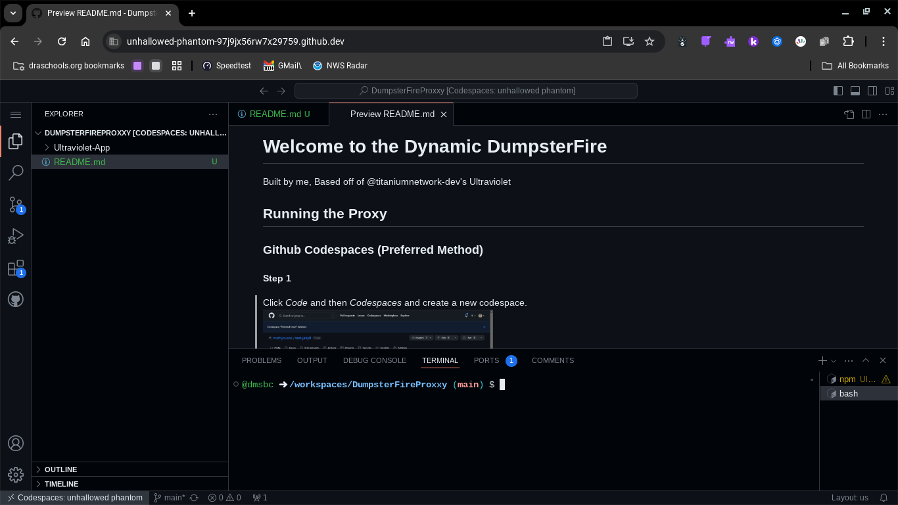
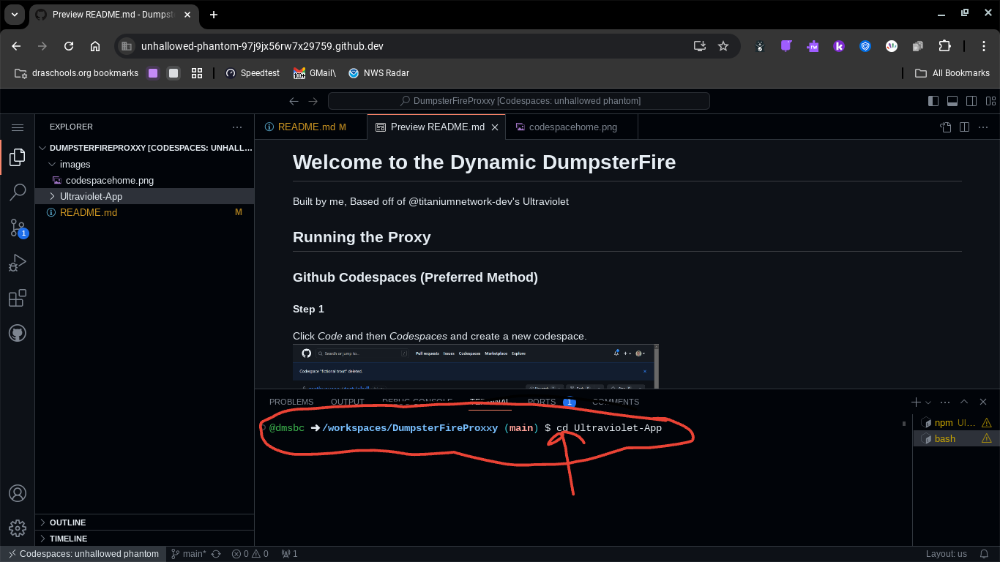
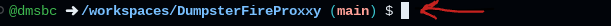
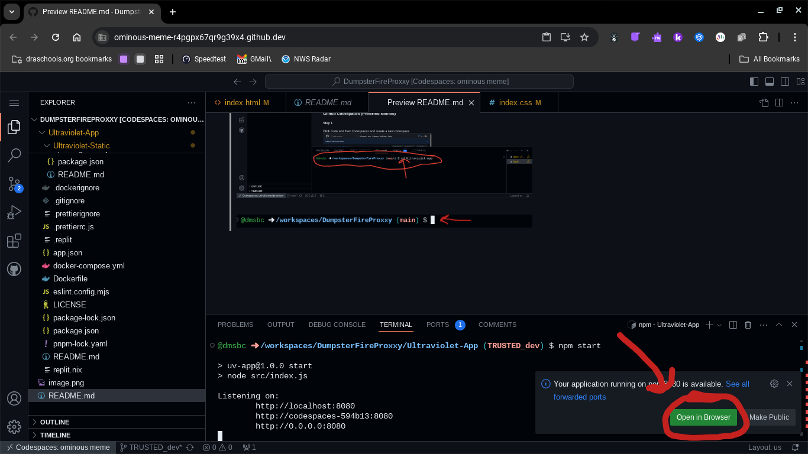

# Welcome to the Dynamic DumpsterFire 
Built by me, Based off of @titaniumnetwork-dev's Ultraviolet
 

## About the Proxy
- Built for a "school project"
- Based off of @titaniumnetwork's Ultraviolet App
- Frontend is "Ultraviolet-Static"
- Called a dumpster fire because everything I code is sort of a Dumpster Fire

## About Me
- I am 14
- I code in html, css, js, node.js, php, circutpython, python, ejs and more
- I will code pretty much anything for anyone.

## Running the Proxy
### Github Codespaces (Preferred Method)
#### Step 1
Click *Code* and then *Codespaces* and create a new codespace.
 

#### Step 2
Wait until you see this screen:
 

#### Step 3
Find the terminal, and type *cd Ultraviolet-App* hit enter. Next, type *npm install* and wait for it to do it's thing, it takes a minute. Once its done, type *npm start* and your server should start.
 
1. cd Ultraviolet-App
2. npm install (takes a min)
3. npm start

 

 
 

#### Step 4
Click open in browser!
 

 

update 11:22 CST
